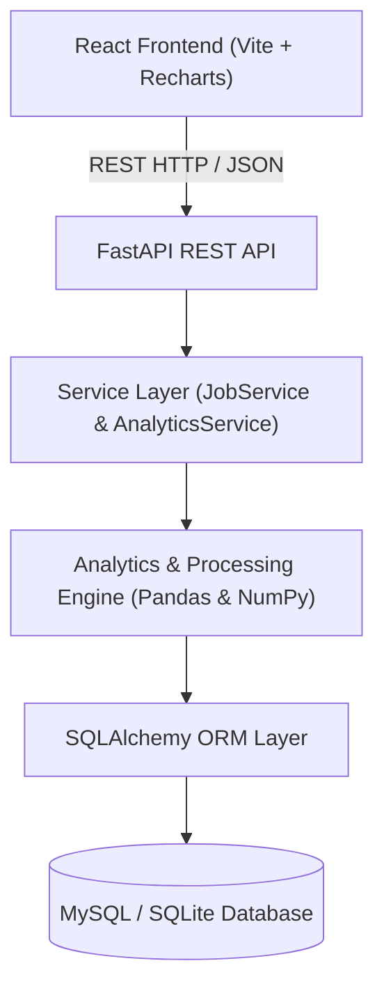
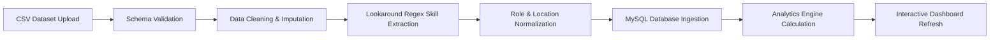

# Job Market Analytics & Skill Demand Analyzer

A full-stack data engineering and analytics application that processes tech job postings, extracts normalized skills with zero false positives, ingests records into MySQL via SQLAlchemy ORM, and exposes an interactive analytics dashboard built with **FastAPI** and **React**.


---

## 📌 Project Overview & Purpose

This application provides real-time labor market intelligence for tech roles by converting raw job posting datasets into structured analytics. It addresses core data engineering challenges—such as deduplication, boundary validation, entity normalization, and skill extraction—and presents key insights through an interactive Web dashboard.

### Dataset Source
- **Dataset Origin**: Synthetic Benchmark Dataset (`5,665` raw records).
- **Synthetic Flag**: All generated postings explicitly maintain `is_synthetic = True` to distinguish research/demo data from live production scrapes.
- **Injected Anomaly Audit**: Contains intentional data quality anomalies including inverted salary bounds, missing values, duplicate postings, and raw title variations to validate the ETL cleaning pipeline.

---

## 🏗️ System Architecture & Ingestion Flow

### System Architecture


### CSV Ingestion & Pipeline Workflow


---

## ⚙️ Data Integrity & Salary Imputation Methodology

To prevent data corruption and misleading compensation statistics:
1. **Inverted Boundary Correction**: If `salary_min > salary_max`, the cleaning pipeline automatically swaps the values to correct input data errors.
2. **Single Boundary Imputation**: If one salary boundary is missing, it is estimated using standard multiplier ratios (`salary_min = 0.80 * salary_max` or `salary_max = 1.25 * salary_min`).
3. **Dual Boundary Imputation**: If both bounds are missing, values are imputed using median salaries grouped by `experience_level`, and the record is flagged with `salary_is_imputed = True`.
4. **Skill Extraction Precision**: Uses lookaround regular expressions ensuring **zero false-positive substring matches** (`JavaScript` does NOT trigger `Java`, `CSS` does NOT trigger `C`).

---

## 📌 Key Features

- **Macro Dashboard**: 6 KPI cards (Total Jobs, Employers, Locations, Unique Skills, Remote Ratio, Average Salary) and 6 Recharts visualizations updating dynamically with global filter changes.
- **Jobs Search & Explorer**: Multi-field search, pagination, client-side/server-side sorting (Newest, Salary High-Low, Salary Low-High), and detailed job drawer modal.
- **Technology Skill Explorer**: Technology market penetration matrix, role-specific demand rankings, and co-occurring tech stack matrices.
- **Role Analytics Explorer**: Role demand share, average compensation bounds, required skills ranking, and experience distribution.
- **Career Skill Gap Analyzer**: Educational self-assessment tool comparing user skills against role requirements (*Purely descriptive; does not make hiring predictions*).
- **CSV Data Ingestion**: File upload UI with schema validation, preview, deduplication, skill extraction, and database insertion.
- **Dark / Light Mode**: Theme toggle switch persisted via `localStorage`.

---

## 🗄️ Database Schema (3NF)

```text
companies (id PK, name UNIQUE, industry, created_at)
locations (id PK, location_name, country, UNIQUE(location_name, country))
jobs      (id PK, job_id UNIQUE, job_title, raw_job_title, seniority_level, company_id FK, location_id FK, employment_type, experience_level, remote_type, salary_min, salary_max, salary_currency, salary_is_imputed, description, education, posting_date, is_synthetic)
skills    (id PK, skill_name UNIQUE, category, created_at)
job_skills(PRIMARY KEY(job_id, skill_id), job_id FK, skill_id FK, source, is_normalized)
```

---

## ⚡ Quick Start & Local Setup

### Prerequisites
- Python 3.10+
- Node.js v18+ & npm
- MySQL Server 8.0+ (or default SQLite fallback)

### 1. Database Setup (MySQL Optional)
Execute `database/schema.sql` against your local MySQL instance:

```bash
mysql -u root -p < database/schema.sql
```

### 2. Backend Setup (FastAPI & SQLAlchemy)
Navigate to the `backend/` directory, set up virtual environment, and configure `.env`:

```bash
cd backend
python -m venv venv
# On Windows: venv\Scripts\activate
# On macOS/Linux: source venv/bin/activate

pip install -r requirements.txt
cp .env.example .env
```

Configure environment credentials in `backend/.env`:
```ini
DATABASE_URL=sqlite:///./job_market.db
DATABASE_HOST=localhost
DATABASE_PORT=3306
DATABASE_NAME=job_market_db
DATABASE_USER=root
DATABASE_PASSWORD=your_mysql_password_here
```

Run the processing pipeline and import data:
```bash
python app/processing/pipeline.py
python app/database/import_data.py
```

Start the FastAPI backend server:
```bash
uvicorn app.main:app --reload --port 8000
```
- Interactive OpenAPI Docs: 👉 `http://localhost:8000/docs`

### 3. Frontend Setup (React & Vite)
In a new terminal, navigate to `frontend/`, install dependencies, and start dev server:

```bash
cd frontend
npm install
npm run dev
```
- React Dashboard App: 👉 `http://localhost:3000`

---

## 🧪 Testing & Build Verification

Run the full automated pytest suite (45 integration and unit tests):

```bash
cd backend
pytest tests/
```

Verify the production frontend bundle compilation:

```bash
cd frontend
npm run build
```

---

## 🛡️ Educational Self-Assessment Disclaimer
*The Career Skill Gap Analyzer is a descriptive educational tool intended for self-assessment. It compares technology skill frequency against public job posting data and does NOT predict hiring probability, interview performance, or guarantee job placement.*

---

## 🚀 Future Improvements
- **NLP Transformer Entity Recognition**: Integrate spaCy or HuggingFace NER models for advanced contextual skill extraction from job descriptions.
- **Historical Salary Trend Forecasts**: Time-series forecasting model for compensation growth by technology stack.
- **Docker Containerization**: Add `docker-compose.yml` to orchestrate MySQL, FastAPI, and NGINX/React with a single command.
